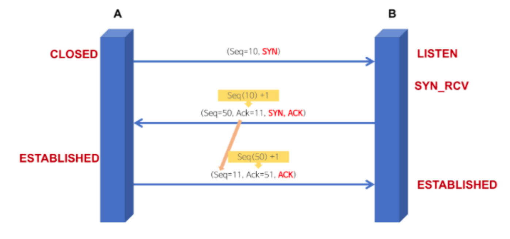
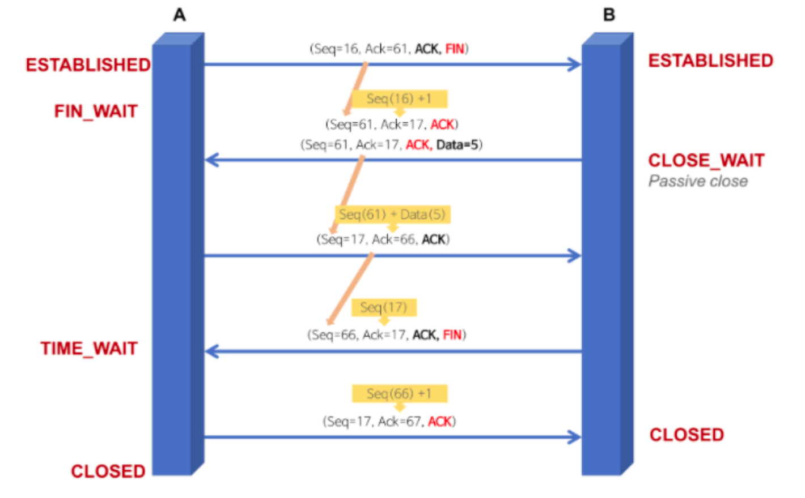

#Network
[OSI 7 Layer](#OSI-7-Layer)
[TCP vs UDP](#TCP-vs-UDP)
[DNS](#DNS)

### OSI 7 Layer
통신이 일어나는 과정을 단계별로 알 수 있고, 특정한 곳에 이상이 생기면 그 단계만 수정할 수 있다.

|Step|Layer|Explain|
|----|-----|--------|
|7|응용계층(Application layer)|응용 프로세스와 직접 관계, 일반적인 응용 서비스 수행(HTTP, FTP, DNS 등), 사용자 인터페이스, 전자우편, 테이터베이스 관리 등의 서비스|
|6|표현계층(Presestation layer)|데이터 표현에 대한 독립성을 제공, 암호화 역할(JPEG, MPEG), 코드 간의 번역 담당, MIME 인코딩이나, 암호화 등의 동작이 이루어진다|
|5|세션계층(Session layer)|데이터가 통신하기 위한 논리적 연결 담당(API, Socket), end-to-end point 통신 관리, 동시 송수신, 반이중 방식, 전이중 방식, TCP/IP세션을 만들고 없애는 역할, TCP/IP는 데이터 흐름관리, 정확성 확인, 패킷의 목적지 보장을 담당|
|4|전송계층(Transport layer)|end to end 사용자들이 신뢰성 있는 데이터를 주고받게 해준다. TCP/UDP 프로토콜을 통해 통신 활성화, PORT, 전송단위는 Segment|
|3|네트워크 계층(Network layer)|데이터를 목적지까지 가장 안전하고 빠르게 전달하는 기능(라우터, IP), 라우팅, 흐름제어, 오류제어, 세그멘테이션 등 수행, 전송 단위는 Datagram(Packet)|
|2|데이터 링크 계층(Data Link layer)|Point to Point간 신뢰성있는 전송을 보장하기 위한 계층, CRC 기반의 오류 제어와 흐름제어가 필요하다. 이더넷, 주소값을 물리적으로 할당, Mac 주소를 통해 통신, 전송 단위는 Frame|
|1|물리 계층(Physical layer)|기본 네트워크로 하드웨어 전송 기술을 이룬다(리피터, 케이블, 허브), 단지 데이터를 전기적인 신호로 변환해서 주고받는 기능을 진행, 논리 데이터 구조를 기초로하는 필수 계층, 전송단위는 Bit|

 

### TCP vs UDP

### TCP

- TCP/IP: TCP는 패킷을 추적 및 관리, IP는 데이터의 배달을 처리
- 연결형 서비스: 3-way handshaking 과정을 통해 연결을 설정하고 4-way handshaking을 통해 해제한다.
[3 way handshaking](#3-way-handshaking)
[4 way handshaking](#4-way-handshaking)

- 흐름 및 혼잡 제어 제공
    - 흐름 제어: 데이터를 송수신하는 곳의 데이터 처리 속도를 조절, 수신자의 버퍼 오버플로우를 방지하는 것
        - Stop and Wait: 매번 전송한 패킷에 대해 확인 응답을 받아야만 그 다음 패킷을 전송하는 방법
        - Sliding Window: 수신측에서 설정한 윈도우 크기만큼 송신측에서 확인응답없이 세그먼트를 전송할 수 있게하여 데이터 흐름을 동적으로 조절하는 제어기업
    - 혼잡 제어: 네트워크 내 패킷 수가 넘치게 증가하지 않도록 방지하는 것(혼잡 붕괴 현상을 막음)
        - AIMD: 처음에 패킷을 하나씩 보내고 이것이 문제없이 도착하면 window 크기를 1씩 증가시켜가며 전송하는 방법(실패하면 패킷을 보내는 속도를 절반으루 줄인다)
        - Slow Start: AIMD 방식의 처음 전송 속도를 올리는데 시간이 오래 걸리는 단점을 보완하여 지수 함수 꼴로 증가한다.
        - Fast Retransmit, Fast Recovery
- 높은 신뢰성 보장
- UDP 보다 속도가 느리다.
- 전이중(Full-Duplex), 점대점(Point to Point) 방식
    - 전이중: 전송이 양방향으로 동시에 일어날 수 있다.
    - 점대점: 각 연결이 정확히 2개의 종단점을 가지고 있다.
- 연속성 보다 신뢰성이 중요한 서비스에 사용하는 프로토콜(ex) 파일 전송)

 

### UDP

- 비연결형 서비스로 데이터그램 방식을 제공한다.
    - 논리적인 경로가 없기 때문에 각각의 패킷은 다른 경로로 전송되고 독립적인 관계를 지니개 된다.
- 정보를 주고 받을 때 신호 절차를 거치지 않는다.
- UDP 헤더의 checksum 필드를 통해 최소한의 오류만 검출
- 신뢰성이 낮다.
- TCP보다 속도가 빠르다.
- 신뢰성보다는 연속성이 중요한 서비스에 사용하는 프로토콜(ex) 실시간 서비스)

 

### DNS(Domain Name Service)에서 UDP를 사용하는 이유

- DNS란?
    - TCP/IP 네트워크 상에서 사람이 기억하기 쉽게 문자로 만들어진 도메인을 컴퓨터가 처리할 수 있는 숫자로 된 인터넷 주소(IP)로 바꾸는 시스템
- DNS는 데이터를 교환하는 경우인데 TCP를 사용하게 되면 데이터를 송신할 때까지 세션 확립을 위한 처리를 하고, 송신한 데이터가 수신되었는지 점검하는 과정이 필요하므로, Protocol overhead가 UDP에 비해서 크다.
- DNS는 응용 계층 프로토콜이다.
- 모든 응용 계층 프로토콜은 TCP, UDP 중 하나의 전송 계층 프로토콜을 사용해야한다.
- 이유
    - DNS request는 UDP segment에 들어갈 정도로 작다
    - 3 way handshaking으로 연결을 유지할 필요가 없다.
    - UDP는 not reliable이지만 reliability는 Timeout 추가나, resend 작업을 통해 응용 계층에 추가할 수 있다.
- DNS는 UDP를 53번 port를 사용한다.

|프로토콜 종류|TCP|UDP|
-----|------|------|
|연결 방식|연결형 서비스|비연결형 서비스|
|패킷 교환 방식|가상 회선 방식|데이터그램 방식|
|전송 순서|전송 순서 보장|전송 순서가 바뀔 수 있음|
|수신 여부 확인|수신 여부를 확인함|수신 여부를 확인하지 않음|
|통신 방식|1:1 통신|1:1 or 1:N or N:N 통신|
|신뢰성|높다|낮다|
|속도|느리다|빠르다|

 

### 3 way handshaking

- TCP통신을 이용하여 데이터를 전송하기 위해 네트워크 연결을 설정하는 과정
- 양쪽 모두 데이터를 전송할 준비가 되었다는 것을 보장하고, 실제로 데이터 전달이 시작하기 전에 한 쪽이 다른 쪽이 준비되었다는 것을 알 수 있도록 한다.
- 즉, TCP/IP 프로토콜을 이용해서 통신을 하는 응용 프로그램이 데이터를 전송하기 전에 먼저 정확한 전송을 보장하기 위해 상대방 컴퓨터와 사전에 세션을 수립하는 과정

1. A->B: SYN
    - 클라이언트 프로세스 A가 서버 프로세스 B에게 연결 요청 메시지(SYN)
    - 송신자가 최초로 데이터를 전송할 때 Sequence Number를 임의의 랜덤 숫자로 지정하고, SYN 플래그 비트를 1로 설정한 세그먼트를 전송한다.
    - PORT 상태 - B: LISTEN, A: CLOSED
2. B->A: SYN + ACK
    - 서버 프로세스 B가 SYN를 받고, 클라이언트 프로세스 A로 받았다는 신호인 ACK와 포트를 열어달라는 SYN 패킷을 전송
    - 수신자는 Acknowledgement Number 필드를 (Seq+1)로 지정하고, SYN과 ACK 플래그 비트를 1로 설정한 세그먼트를 전송한다.
    - PORT 상태 - B: SYN_RCV, A: CLOSED
3. A->B: ACK
    - PORT 상태 - B: SYN_RCV, A: ESTABLISHED
    - 클라이언트 프로세스 A는 서버 프로세스 B의 응답인 ACK와 SYN 패킷을 받고, 수락 확인 신호인 ACK를 서버 프로세스 B로 보낸다.
    - 이때, 전송할 데이터가 있으면 이 단계에서 데이터를 전송할 수 있다.
    - PORT 상태 - B: ESTABLISHED, A: ESTABLISHED

 

### 4 way handshaking

- TCP의 연결을 해제하는 과정
    - A 프로세스(Client)가 B 프로세스(Server)에 연결 해제 요청

1. A->B: FIN
    - 클라이언트 프로세스 A가 연결을 종료하겠다는 FIN플래그를 전송
    - 서버 프로세스 B가 FIN 플래그로 응답하기 전까지 연결을 계속 유지
2. B->A: ACK
    - 서버 프로세스 B는 FIN을 받고, 확인했다는 ACK를 클라이언트 프로세스 A로 보내고 자신의 통신이 끝날 때까지 기다린다.(TIME_WAIT 상태)
    - 수신자는 ACK Number 필드를 (seq+1)로 지정하고, ACK 플래그 비트를 1로 설장한 세그먼트를 전송한다.
    - 자신이 전송할 데이터가 남아있다면 이어서 계속 전송한다.
3. B->A: FIN
    - 서버 프로세스 B가 통신이 끝났으면 연결이 종료되었다는 의미로 클라이언트 프로세스 A에게 FIN 플래그를 전송
4. A->B: ACK
    - 클라이언트 프로세스 A는 FIN을 받고, 확인했다는 ACK를 서버 프로세스 B에 전송
    - 아직 서버로부터 받지 못한 데이터가 있을 수 있으므로 TIME_WAIT을 통해 기다린다
        - 서버 B는 ACK를 받은 이후 소켓을 닫는다.(CLOSED)
        - TIME_WAIT 시간이 끝나면 클라이언트 A도 닫는다.(CLOSED)