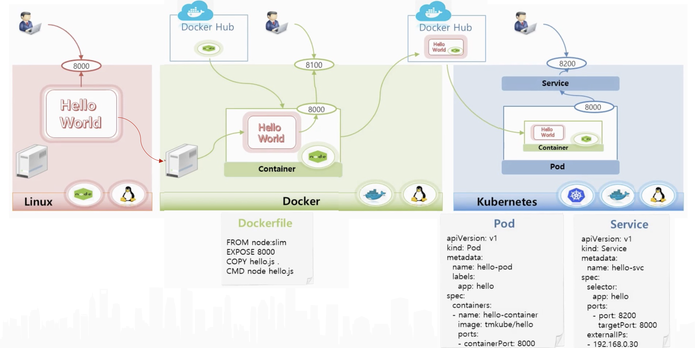
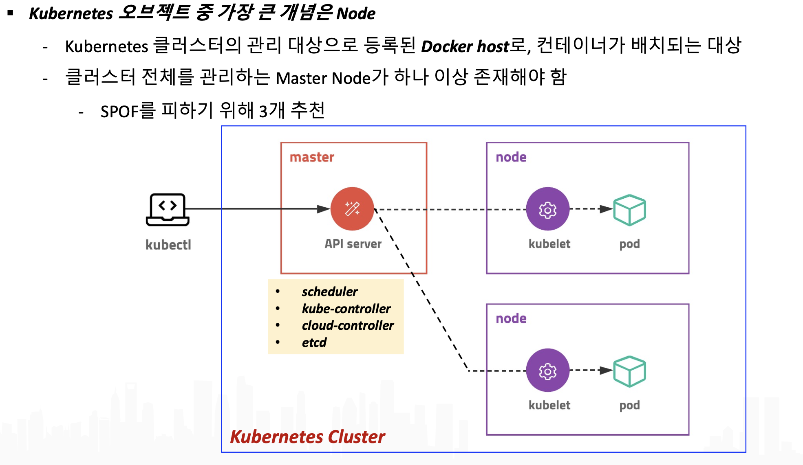
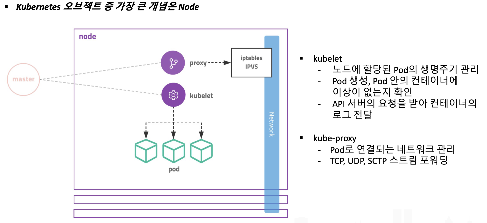
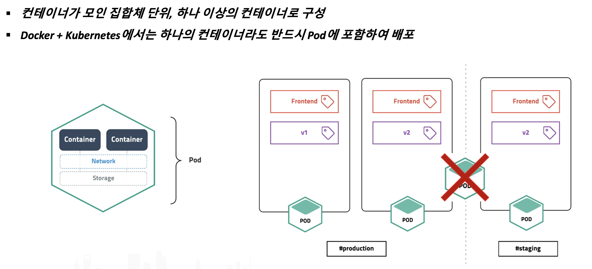
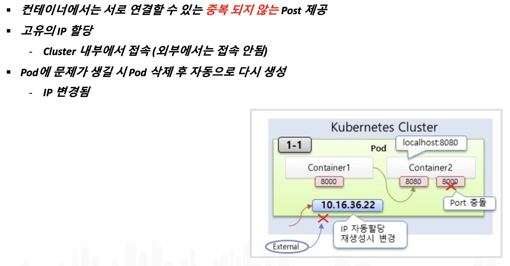
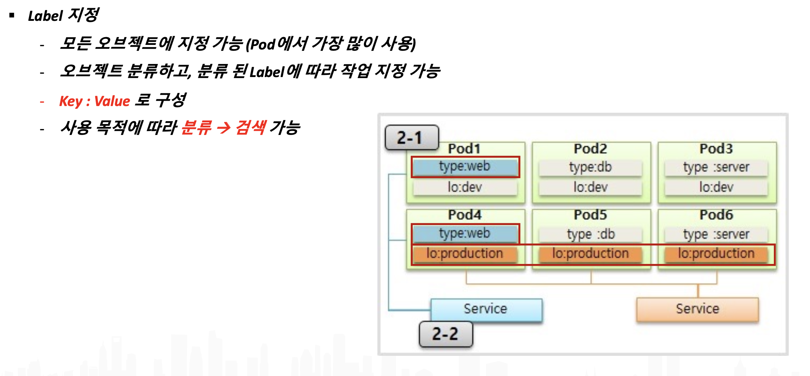

# Kubernetes
- [kube 개념](#개념)
- [kube 설계도](#설계도)
- [kube Cluster](#Cluster)
- [kube Pod](#Pod)
- [kube example code](#code)
- [kube Command](#Command)

<br>

### 개념
- Docker Container 운영을 자동화하기 위한 컨테이너 오케스트레이션 툴
- Replica (Scale in/Scale out)
- 오토 스케일링 지원 
(수요급증으로 발생하는 서비스 중단을 더는 걱정하지 않아도된다.)
- Service discovery

|Resource or Obejct|용도|
|------|---------------|
|Node|컨테이너가 배치되는 서버|
|Namespace|쿠버네티스 클러스터 안의 가상 클러스터|
|Pod|컨테이너의 집합 중 가장 작은 다윈, 컨테이너의 실행 방법 정의|
|Replica Set|같은 스펙을 갖는 Pod를 여러개 생성하고 관리하는 역할|
|Deployment|레플리카 세트의 리비전 관리|
|Service|Pod의 집합에 접근하기 위한 경로를 정의|
|Ingress|서비스를 쿠버네티스 클러스터 외부로 노출|
|ConfigMap|설정 정보를 정의하고 Pod에 전달|
|Persistent Volume|Pod가 사용할 스토리지의 크리 및 종류를 정의|
|Persistent Volume Claim|퍼시스턴트 볼륨을 동적으로 확보|

<br>

### 설계도


<br>

### Cluster


<br>



<br>

### Pod


<br>



<br>

### code
- node_pod.yml

```
apiVersion: v1
kind: Pod
metadata:
  name: hello
  labels:
    app: hello
    os: linux
    lang: node
spec:
  containers:
  - name: hello-container
    image: linkclean/hello
    ports:
      - containerPort: 8000
```

<br>

- node_service.yml
```
apiVersion: v1
kind: Service
metadata:
  name: hello-svc
spec:
  selector:
    app: hello
  ports:
    - port: 8200
      targetPort: 8000
```

<br>

- pod_demo.yml
```
apiVersion: v1
kind: Pod
metadata:
  name: pod-1
spec:
  containers:
  - name: container1
    image: kubetm/p8000
    ports:
      - containerPort: 8000
  - name: container2
    image: kubetm/p8080
    ports:
      - containerPort: 8080
```

<br>

- label을 활용한 pod 관리


<br>

- pod_demo.yml
```
apiVersion: v1
kind: Pod
metadata:
  name: pod1
  labels:
    type: web
    lo: dev
spec:
  containers:
  - name: container
    image: kubetm/init
```
```
apiVersion: v1
kind: Pod
metadata:
  name: pod4
  labels:
    type: web
    lo: production
spec:
  containers:
  - name: container
    image: kubetm/init
```

- pod_service.yml
```
apiVersion: v1
kind: Service
metadata:
  name: svc-2
spec:
  selector:
    type: web
    #lo: production
  ports:
  - port: 8080
```

<br>

### Command
- Pod 정보
> kubectl get pods\

> kubectl get pods -o wide\

> kubectl describe pod [name]\

> kubectl get services

> kubectl get pod simple-echo -o yaml

- location, type
> kubectl get pods -l type=db\

> kubectl get pods -l lo=production\

<br>

- Service 수정
> kubectl edit service [name]\

> clusterIP: 클러스터 내부 통신\

> NodePort: 클러스터 외부 통신\

<br>

- Dashboard get token
> kubectl describe serviceaccount kubernetes-dashboard -n kubernetes-dashboard

> kubectl describe secret kubernetes-dashboard-token-c55rh -n kubernetes-dashboard

<br>

- Scale
> kubectl scale deployment [name]--replicas=[number]

<br>

- yaml 실행, kuber에 오브젝트 반영
> kubectl apply -f [filename]

<br>

- pod terminating 강제 삭제
> kubectl delete pod \<PODNAME> --grace-period=0 --force --namespace \<NAMESPACE>

### Kubernetes Deployment
- 애플리케이션 배포의 기본 단위
- ReplicaSet을 관리하기 위한 Object
- ReplicaSet은 버전관리에 어려움이 있기 때문에
  - deployment를 이용

<br>

- 예제 코드
```
apiVersion: apps/v1
kind: Deployment
metadata:
  name: echo
  labels:
    app: echo
spec:
  # 케이스에 따라 레플리카를 수정한다.
  replicas: 4
  selector:
    matchLabels:
      app: echo
  template:
    metadata:
      labels:
        app: echo
    spec:
      containers:
      - name: nginx
        image: nginx:latest
        env:
        - name: BACKEND_HOST
          value: localhost:8080
        ports:
        - containerPort: 80
      - name: echo
        image: gihyodocker/echo:latest
        env:
        - name: FRONT_HOST
          value: localhost:80
        ports:
        - containerPort: 8080
```

- deployment history 관리
> kubectl rollout history deployment echo

> kubectl apply -f simple-deployment.yml --record

> kubectl get pod,replicaset,deployment --selector app=echo

```
--record 로 기록 저장 후
history로 확인결과 아래와 같이 바뀐것을 확인

deployment.apps/echo 
REVISION  CHANGE-CAUSE
1         kubectl apply --filename=simple-deployment.yml --record=true

--yml 환경변수 수정 후
revision이 새로 생긴것을 확인 가능(새로운 버전으로 배포)
revision을 통해서 이전 버전으로 돌아갈 수 있다

deployment.apps/echo 
REVISION  CHANGE-CAUSE
1         kubectl apply --filename=simple-deployment.yml --record=true
2         kubectl apply --filename=simple-deployment.yml --record=true

--revision 1로 롤백
kubectl rollout undo deployment echo --to-revision=1

--이미지 업데이트
kubectl set image deployment echo echo=edowon0623/hello:latest
```

### kuber - Service
- cluster 안에서 pod의 집합에 대한 경로나 service discovery를 제공하는 object
- pod에 접속하기 위한 network endpoint
- pod는 재생성이 가능하며, 재생성 시 IP는 변경(동적 IP, 불완전 IP)
- Service는 한번 생성 후 삭제 시키기 전까지는 계속 유지
- load balancing과 같은 역할을 한다
- local: nodePort
- aws: LoadBalancer
```
apiVersion: v1
kind: Service
metadata:
  name: echo
spec:
  selector:
    app: echo
  ports:
    - name: http
      port: 80

echo-spring 과 echo-summer를 80 포트(외부)에 연결
```

